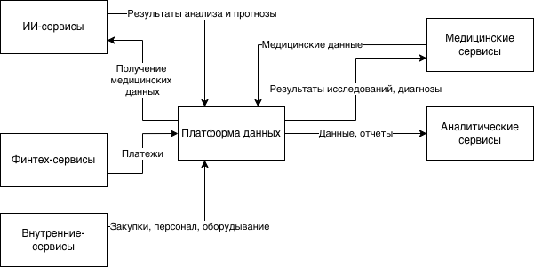

## Разделение системы на домены и моделирование потоков данных для поддержки ключевых бизнес-сценариев

### Домены. Потоки данных между доменами

| Домен                 | Зона ответственности                         | Бизнес-сценарии                                                              |
|:----------------------|:---------------------------------------------|:-----------------------------------------------------------------------------|
| ИИ-сервисы            | ИИ-сервисы для работы с медицинскими данными | Медицинские исследования, первичная обработка данных, формирование прогнозов |
| Финтех-сервисы        | Платежи                                      | Обработка платежей, выставление счетов                                       |
| Внутренние сервисы    | Закупки, персонал, оборудование              | Управленческая отчетность                                                    |  
| Медицинские сервисы   | Медицинские данные, диагнозы                 | Ведение электронных медицинских карт                                         |
| Аналитические сервисы | Отчеты                                       | Формирование сводных отчетов                                                 |

[future_2_0_dfd.drawio](future_2_0_dfd.drawio)

### Преимущества для бизнеса

* Ускорение вывода продуктов. Различные домены развиваются независимо. Повышается time-to-market.
* Снижение зависимости от DWH. Каждый домен имеет свой независимый Data Product.
* Повышение качества данных. Возможность управления данными и соблюдение правил безопасности.
