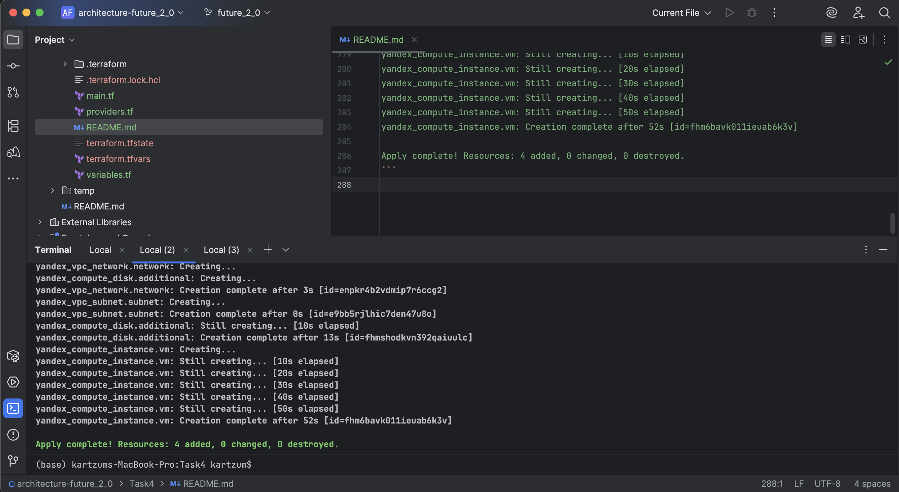
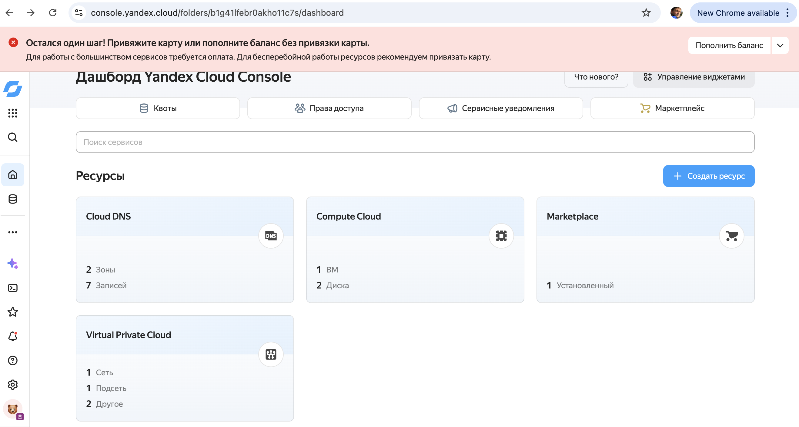
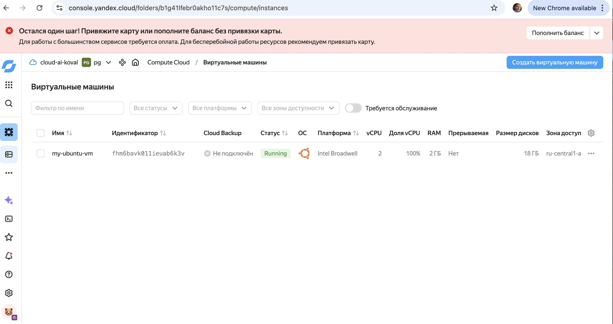

## Проектирование облачной инфраструктуры с применением IaaS и Terraform 1

### Запуск

```
terraform init
```

```
terraform validate
```

Пример вывода.
```
Success! The configuration is valid.
```

```
terraform plan
```

Пример вывода.
```
data.yandex_compute_image.ubuntu: Reading...
data.yandex_compute_image.ubuntu: Read complete after 0s [id=fd8jr9omc57n4c6hev20]

Terraform used the selected providers to generate the following execution plan. Resource actions are indicated with the following symbols:
  + create

Terraform will perform the following actions:

  # yandex_compute_disk.additional will be created
  + resource "yandex_compute_disk" "additional" {
      + block_size  = 4096
      + created_at  = (known after apply)
      + folder_id   = (known after apply)
      + id          = (known after apply)
      + name        = "my-ubuntu-vm-disk"
      + product_ids = (known after apply)
      + size        = 10
      + status      = (known after apply)
      + type        = "network-hdd"
      + zone        = "ru-central1-a"
    }

  # yandex_compute_instance.vm will be created
  + resource "yandex_compute_instance" "vm" {
      + created_at                = (known after apply)
      + folder_id                 = (known after apply)
      + fqdn                      = (known after apply)
      + gpu_cluster_id            = (known after apply)
      + hardware_generation       = (known after apply)
      + hostname                  = (known after apply)
      + id                        = (known after apply)
      + labels                    = {
          + "environment" = "dev"
          + "project"     = "future_2_0"
        }
      + maintenance_grace_period  = (known after apply)
      + maintenance_policy        = (known after apply)
      + name                      = "my-ubuntu-vm"
      + network_acceleration_type = "standard"
      + platform_id               = "standard-v1"
      + status                    = (known after apply)
      + zone                      = "ru-central1-a"

      + boot_disk {
          + auto_delete = true
          + device_name = (known after apply)
          + disk_id     = (known after apply)
          + mode        = (known after apply)

          + initialize_params {
              + block_size  = (known after apply)
              + description = (known after apply)
              + image_id    = "fd8jr9omc57n4c6hev20"
              + name        = (known after apply)
              + size        = 8
              + snapshot_id = (known after apply)
              + type        = "network-hdd"
            }
        }

      + network_interface {
          + index          = (known after apply)
          + ip_address     = (known after apply)
          + ipv4           = true
          + ipv6           = (known after apply)
          + ipv6_address   = (known after apply)
          + mac_address    = (known after apply)
          + nat            = true
          + nat_ip_address = (known after apply)
          + nat_ip_version = (known after apply)
          + subnet_id      = (known after apply)
        }

      + resources {
          + core_fraction = 100
          + cores         = 2
          + memory        = 2
        }

      + secondary_disk {
          + auto_delete = false
          + device_name = (known after apply)
          + disk_id     = (known after apply)
          + mode        = "READ_WRITE"
        }
    }

  # yandex_vpc_network.network will be created
  + resource "yandex_vpc_network" "network" {
      + created_at                = (known after apply)
      + default_security_group_id = (known after apply)
      + folder_id                 = (known after apply)
      + id                        = (known after apply)
      + labels                    = (known after apply)
      + name                      = "my-ubuntu-vm-network"
      + subnet_ids                = (known after apply)
    }

  # yandex_vpc_subnet.subnet will be created
  + resource "yandex_vpc_subnet" "subnet" {
      + created_at     = (known after apply)
      + folder_id      = (known after apply)
      + id             = (known after apply)
      + labels         = (known after apply)
      + name           = "my-ubuntu-vm-subnet"
      + network_id     = (known after apply)
      + v4_cidr_blocks = [
          + "10.0.1.0/24",
        ]
      + v6_cidr_blocks = (known after apply)
      + zone           = "ru-central1-a"
    }

Plan: 4 to add, 0 to change, 0 to destroy.

────────────────────────────────────────────────────────────────────────────────────────────────────────────────────────────────────────────────────────────────────── 

Note: You didn't use the -out option to save this plan, so Terraform can't guarantee to take exactly these actions if you run "terraform apply" now.
```

```
terraform apply
```

Пример вывода.
```
data.yandex_compute_image.ubuntu: Reading...
data.yandex_compute_image.ubuntu: Read complete after 0s [id=fd8jr9omc57n4c6hev20]

Terraform used the selected providers to generate the following execution plan. Resource actions are indicated with the following symbols:
  + create

Terraform will perform the following actions:

  # yandex_compute_disk.additional will be created
  + resource "yandex_compute_disk" "additional" {
      + block_size  = 4096
      + created_at  = (known after apply)
      + folder_id   = (known after apply)
      + id          = (known after apply)
      + name        = "my-ubuntu-vm-disk"
      + product_ids = (known after apply)
      + size        = 10
      + status      = (known after apply)
      + type        = "network-hdd"
      + zone        = "ru-central1-a"
    }

  # yandex_compute_instance.vm will be created
  + resource "yandex_compute_instance" "vm" {
      + created_at                = (known after apply)
      + folder_id                 = (known after apply)
      + fqdn                      = (known after apply)
      + gpu_cluster_id            = (known after apply)
      + hardware_generation       = (known after apply)
      + hostname                  = (known after apply)
      + id                        = (known after apply)
      + labels                    = {
          + "environment" = "dev"
          + "project"     = "future_2_0"
        }
      + maintenance_grace_period  = (known after apply)
      + maintenance_policy        = (known after apply)
      + name                      = "my-ubuntu-vm"
      + network_acceleration_type = "standard"
      + platform_id               = "standard-v1"
      + status                    = (known after apply)
      + zone                      = "ru-central1-a"

      + boot_disk {
          + auto_delete = true
          + device_name = (known after apply)
          + disk_id     = (known after apply)
          + mode        = (known after apply)

          + initialize_params {
              + block_size  = (known after apply)
              + description = (known after apply)
              + image_id    = "fd8jr9omc57n4c6hev20"
              + name        = (known after apply)
              + size        = 8
              + snapshot_id = (known after apply)
              + type        = "network-hdd"
            }
        }

      + network_interface {
          + index          = (known after apply)
          + ip_address     = (known after apply)
          + ipv4           = true
          + ipv6           = (known after apply)
          + ipv6_address   = (known after apply)
          + mac_address    = (known after apply)
          + nat            = true
          + nat_ip_address = (known after apply)
          + nat_ip_version = (known after apply)
          + subnet_id      = (known after apply)
        }

      + resources {
          + core_fraction = 100
          + cores         = 2
          + memory        = 2
        }

      + secondary_disk {
          + auto_delete = false
          + device_name = (known after apply)
          + disk_id     = (known after apply)
          + mode        = "READ_WRITE"
        }
    }

  # yandex_vpc_network.network will be created
  + resource "yandex_vpc_network" "network" {
      + created_at                = (known after apply)
      + default_security_group_id = (known after apply)
      + folder_id                 = (known after apply)
      + id                        = (known after apply)
      + labels                    = (known after apply)
      + name                      = "my-ubuntu-vm-network"
      + subnet_ids                = (known after apply)
    }

  # yandex_vpc_subnet.subnet will be created
  + resource "yandex_vpc_subnet" "subnet" {
      + created_at     = (known after apply)
      + folder_id      = (known after apply)
      + id             = (known after apply)
      + labels         = (known after apply)
      + name           = "my-ubuntu-vm-subnet"
      + network_id     = (known after apply)
      + v4_cidr_blocks = [
          + "10.0.1.0/24",
        ]
      + v6_cidr_blocks = (known after apply)
      + zone           = "ru-central1-a"
    }

Plan: 4 to add, 0 to change, 0 to destroy.

Do you want to perform these actions?
  Terraform will perform the actions described above.
  Only 'yes' will be accepted to approve.

  Enter a value: yes

yandex_vpc_network.network: Creating...
yandex_compute_disk.additional: Creating...
yandex_vpc_network.network: Creation complete after 3s [id=enpkr4b2vdmip7r6ccg2]
yandex_vpc_subnet.subnet: Creating...
yandex_vpc_subnet.subnet: Creation complete after 0s [id=e9bb5rjlhic7den47u8o]
yandex_compute_disk.additional: Still creating... [10s elapsed]
yandex_compute_disk.additional: Creation complete after 13s [id=fhmshodkvn392qaiuulc]
yandex_compute_instance.vm: Creating...
yandex_compute_instance.vm: Still creating... [10s elapsed]
yandex_compute_instance.vm: Still creating... [20s elapsed]
yandex_compute_instance.vm: Still creating... [30s elapsed]
yandex_compute_instance.vm: Still creating... [40s elapsed]
yandex_compute_instance.vm: Still creating... [50s elapsed]
yandex_compute_instance.vm: Creation complete after 52s [id=fhm6bavk011ieuab6k3v]

Apply complete! Resources: 4 added, 0 changed, 0 destroyed.
```

```
terraform show
```

Пример вывода.
```
# data.yandex_compute_image.ubuntu:
data "yandex_compute_image" "ubuntu" {
    created_at          = "2026-04-13T11:29:07Z"
    description         = "Ubuntu 22.04 lts v20260410030356"
    family              = "ubuntu-2204-lts"
    folder_id           = "standard-images"
    hardware_generation = [
        {
            generation2_features = []
            legacy_features      = [
                {
                    pci_topology = "PCI_TOPOLOGY_V2"
                },
            ]
        },
    ]
    id                  = "fd8jr9omc57n4c6hev20"
    image_id            = "fd8jr9omc57n4c6hev20"
    labels              = {
        "version"                  = "20260410030356"
        "x-hopper-operation-id"    = "d9p8trgfhhkaq1g4scjv"
        "x-hopper-source-image-id" = "fd8evugkccqhqqj9asgp"
    }
    min_disk_size       = 8
    name                = "ubuntu-22-04-lts-v20260413"
    os_type             = "linux"
    pooled              = true
    product_ids         = [
        "f2ei2qr19o45f45nrdpd",
    ]
    size                = 2
    status              = "ready"
}

# yandex_compute_disk.additional:
resource "yandex_compute_disk" "additional" {
    block_size  = 4096
    created_at  = "2026-04-13T16:15:53Z"
    folder_id   = "b1g41lfebr0akho11c7s"
    id          = "fhmshodkvn392qaiuulc"
    name        = "my-ubuntu-vm-disk"
    product_ids = []
    size        = 10
    status      = "ready"
    type        = "network-hdd"
    zone        = "ru-central1-a"

    disk_placement_policy {}

    hardware_generation {
        legacy_features {
            pci_topology = "PCI_TOPOLOGY_V2"
        }
    }
}

# yandex_compute_instance.vm:
resource "yandex_compute_instance" "vm" {
    created_at                = "2026-04-13T16:16:06Z"
    folder_id                 = "b1g41lfebr0akho11c7s"
    fqdn                      = "fhm6bavk011ieuab6k3v.auto.internal"
    hardware_generation       = [
        {
            generation2_features = []
            legacy_features      = [
                {
                    pci_topology = "PCI_TOPOLOGY_V2"
                },
            ]
        },
    ]
    id                        = "fhm6bavk011ieuab6k3v"
    labels                    = {
        "environment" = "dev"
        "project"     = "future_2_0"
    }
    name                      = "my-ubuntu-vm"
    network_acceleration_type = "standard"
    platform_id               = "standard-v1"
    status                    = "running"
    zone                      = "ru-central1-a"

    boot_disk {
        auto_delete = true
        device_name = "fhm36ge0m7s3cv89h7fb"
        disk_id     = "fhm36ge0m7s3cv89h7fb"
        mode        = "READ_WRITE"

        initialize_params {
            block_size = 4096
            image_id   = "fd8jr9omc57n4c6hev20"
            size       = 8
            type       = "network-hdd"
        }
    }

    metadata_options {
        aws_v1_http_endpoint = 1
        aws_v1_http_token    = 2
        gce_http_endpoint    = 1
        gce_http_token       = 1
    }

    network_interface {
        index          = 0
        ip_address     = "10.0.1.26"
        ipv4           = true
        ipv6           = false
        mac_address    = "d0:0d:65:ab:f4:00"
        nat            = true
        nat_ip_address = "111.88.253.243"
        nat_ip_version = "IPV4"
        subnet_id      = "e9bb5rjlhic7den47u8o"
    }

    placement_policy {
        host_affinity_rules       = []
        placement_group_partition = 0
    }

    resources {
        core_fraction = 100
        cores         = 2
        gpus          = 0
        memory        = 2
    }

    scheduling_policy {
        preemptible = false
    }

    secondary_disk {
        auto_delete = false
        device_name = "fhmshodkvn392qaiuulc"
        disk_id     = "fhmshodkvn392qaiuulc"
        mode        = "READ_WRITE"
    }
}

# yandex_vpc_network.network:
resource "yandex_vpc_network" "network" {
    created_at                = "2026-04-13T16:15:53Z"
    default_security_group_id = "enpqa106cgti60b8ejem"
    folder_id                 = "b1g41lfebr0akho11c7s"
    id                        = "enpkr4b2vdmip7r6ccg2"
    labels                    = {}
    name                      = "my-ubuntu-vm-network"
    subnet_ids                = []
}

# yandex_vpc_subnet.subnet:
resource "yandex_vpc_subnet" "subnet" {
    created_at     = "2026-04-13T16:15:56Z"
    folder_id      = "b1g41lfebr0akho11c7s"
    id             = "e9bb5rjlhic7den47u8o"
    labels         = {}
    name           = "my-ubuntu-vm-subnet"
    network_id     = "enpkr4b2vdmip7r6ccg2"
    v4_cidr_blocks = [
        "10.0.1.0/24",
    ]
    v6_cidr_blocks = []
    zone           = "ru-central1-a"
}
```







```
terraform destroy
```

Пример вывода.
```
data.yandex_compute_image.ubuntu: Reading...
yandex_vpc_network.network: Refreshing state... [id=enpkr4b2vdmip7r6ccg2]
yandex_compute_disk.additional: Refreshing state... [id=fhmshodkvn392qaiuulc]
yandex_vpc_subnet.subnet: Refreshing state... [id=e9bb5rjlhic7den47u8o]
data.yandex_compute_image.ubuntu: Read complete after 0s [id=fd8jr9omc57n4c6hev20]
yandex_compute_instance.vm: Refreshing state... [id=fhm6bavk011ieuab6k3v]

Terraform used the selected providers to generate the following execution plan. Resource actions are indicated with the following symbols:
  - destroy

Terraform will perform the following actions:

  # yandex_compute_disk.additional will be destroyed
  - resource "yandex_compute_disk" "additional" {
      - block_size  = 4096 -> null
      - created_at  = "2026-04-13T16:15:53Z" -> null
      - folder_id   = "b1g41lfebr0akho11c7s" -> null
      - id          = "fhmshodkvn392qaiuulc" -> null
      - labels      = {} -> null
      - name        = "my-ubuntu-vm-disk" -> null
      - product_ids = [] -> null
      - size        = 10 -> null
      - status      = "ready" -> null
      - type        = "network-hdd" -> null
      - zone        = "ru-central1-a" -> null

      - disk_placement_policy {}

      - hardware_generation {
          - legacy_features {
              - pci_topology = "PCI_TOPOLOGY_V2" -> null
            }
        }
    }

  # yandex_compute_instance.vm will be destroyed
  - resource "yandex_compute_instance" "vm" {
      - created_at                = "2026-04-13T16:16:06Z" -> null
      - folder_id                 = "b1g41lfebr0akho11c7s" -> null
      - fqdn                      = "fhm6bavk011ieuab6k3v.auto.internal" -> null
      - hardware_generation       = [
          - {
              - generation2_features = []
              - legacy_features      = [
                  - {
                      - pci_topology = "PCI_TOPOLOGY_V2"
                    },
                ]
            },
        ] -> null
      - id                        = "fhm6bavk011ieuab6k3v" -> null
      - labels                    = {
          - "environment" = "dev"
          - "project"     = "future_2_0"
        } -> null
      - metadata                  = {} -> null
      - name                      = "my-ubuntu-vm" -> null
      - network_acceleration_type = "standard" -> null
      - platform_id               = "standard-v1" -> null
      - status                    = "running" -> null
      - zone                      = "ru-central1-a" -> null

      - boot_disk {
          - auto_delete = true -> null
          - device_name = "fhm36ge0m7s3cv89h7fb" -> null
          - disk_id     = "fhm36ge0m7s3cv89h7fb" -> null
          - mode        = "READ_WRITE" -> null

          - initialize_params {
              - block_size = 4096 -> null
              - image_id   = "fd8jr9omc57n4c6hev20" -> null
              - size       = 8 -> null
              - type       = "network-hdd" -> null
            }
        }

      - metadata_options {
          - aws_v1_http_endpoint = 1 -> null
          - aws_v1_http_token    = 2 -> null
          - gce_http_endpoint    = 1 -> null
          - gce_http_token       = 1 -> null
        }

      - network_interface {
          - index              = 0 -> null
          - ip_address         = "10.0.1.26" -> null
          - ipv4               = true -> null
          - ipv6               = false -> null
          - mac_address        = "d0:0d:65:ab:f4:00" -> null
          - nat                = true -> null
          - nat_ip_address     = "111.88.253.243" -> null
          - nat_ip_version     = "IPV4" -> null
          - security_group_ids = [] -> null
          - subnet_id          = "e9bb5rjlhic7den47u8o" -> null
        }

      - placement_policy {
          - host_affinity_rules       = [] -> null
          - placement_group_partition = 0 -> null
        }

      - resources {
          - core_fraction = 100 -> null
          - cores         = 2 -> null
          - gpus          = 0 -> null
          - memory        = 2 -> null
        }

      - scheduling_policy {
          - preemptible = false -> null
        }

      - secondary_disk {
          - auto_delete = false -> null
          - device_name = "fhmshodkvn392qaiuulc" -> null
          - disk_id     = "fhmshodkvn392qaiuulc" -> null
          - mode        = "READ_WRITE" -> null
        }
    }

  # yandex_vpc_network.network will be destroyed
  - resource "yandex_vpc_network" "network" {
      - created_at                = "2026-04-13T16:15:53Z" -> null
      - default_security_group_id = "enpqa106cgti60b8ejem" -> null
      - folder_id                 = "b1g41lfebr0akho11c7s" -> null
      - id                        = "enpkr4b2vdmip7r6ccg2" -> null
      - labels                    = {} -> null
      - name                      = "my-ubuntu-vm-network" -> null
      - subnet_ids                = [
          - "e9bb5rjlhic7den47u8o",
        ] -> null
    }

  # yandex_vpc_subnet.subnet will be destroyed
  - resource "yandex_vpc_subnet" "subnet" {
      - created_at     = "2026-04-13T16:15:56Z" -> null
      - folder_id      = "b1g41lfebr0akho11c7s" -> null
      - id             = "e9bb5rjlhic7den47u8o" -> null
      - labels         = {} -> null
      - name           = "my-ubuntu-vm-subnet" -> null
      - network_id     = "enpkr4b2vdmip7r6ccg2" -> null
      - v4_cidr_blocks = [
          - "10.0.1.0/24",
        ] -> null
      - v6_cidr_blocks = [] -> null
      - zone           = "ru-central1-a" -> null
    }

Plan: 0 to add, 0 to change, 4 to destroy.

Do you really want to destroy all resources?
  Terraform will destroy all your managed infrastructure, as shown above.
  There is no undo. Only 'yes' will be accepted to confirm.

  Enter a value: yes

yandex_compute_instance.vm: Destroying... [id=fhm6bavk011ieuab6k3v]
yandex_compute_instance.vm: Still destroying... [id=fhm6bavk011ieuab6k3v, 10s elapsed]
yandex_compute_instance.vm: Still destroying... [id=fhm6bavk011ieuab6k3v, 20s elapsed]
yandex_compute_instance.vm: Still destroying... [id=fhm6bavk011ieuab6k3v, 30s elapsed]
yandex_compute_instance.vm: Destruction complete after 36s
yandex_vpc_subnet.subnet: Destroying... [id=e9bb5rjlhic7den47u8o]
yandex_compute_disk.additional: Destroying... [id=fhmshodkvn392qaiuulc]
yandex_vpc_subnet.subnet: Destruction complete after 2s
yandex_vpc_network.network: Destroying... [id=enpkr4b2vdmip7r6ccg2]
yandex_vpc_network.network: Destruction complete after 1s
yandex_compute_disk.additional: Destruction complete after 4s

Destroy complete! Resources: 4 destroyed.
```
